# Air Dots Card for Home Assistant

[](https://github.com/hacs/integration)
[](https://www.home-assistant.io/)
[](https://github.com/tioan/air-dots-card)
[](https://claude.ai)

A custom Lovelace card inspired by the Awair air quality monitor UI.  
Displays up to 5 sensors with a **dot-bar indicator**, color-coded by severity, and a **score ring** or **inline score column**. Fully configurable via the Home Assistant UI editor — no YAML required.

**3 themes × 5 score positions = 15 combinations.**

<br>

## Themes & Score Positions

### 🌑 Default (Awair dark)

| ⬆ Center | ◀ Left | Right ▶ |
|:---:|:---:|:---:|
| 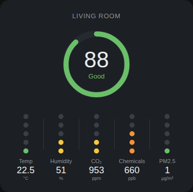 | 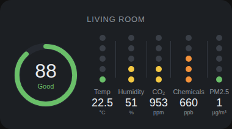 | 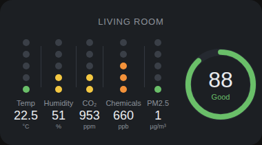 |

| ↔ Inline Left | Inline Right ↔ |
|:---:|:---:|
| 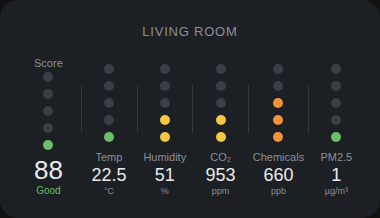 | 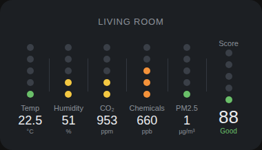 |

### 🍄 Mushroom

| ⬆ Center | ◀ Left | Right ▶ |
|:---:|:---:|:---:|
| 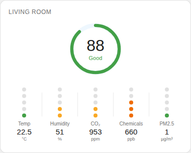 | 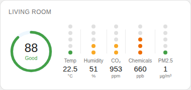 | 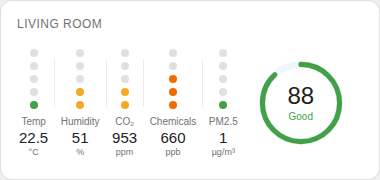 |

| ↔ Inline Left | Inline Right ↔ |
|:---:|:---:|
| 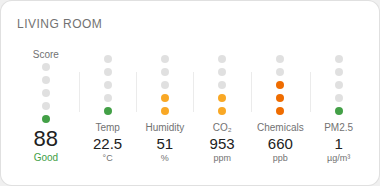 | 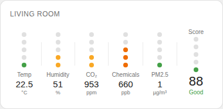 |

### 🫧 Bubble Card

| ⬆ Center | ◀ Left | Right ▶ |
|:---:|:---:|:---:|
| 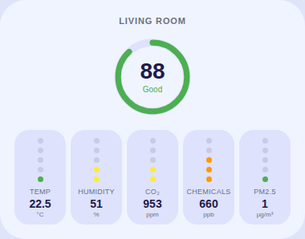 | 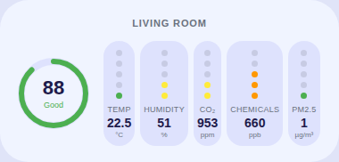 | 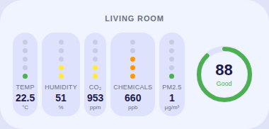 |

| ↔ Inline Left | Inline Right ↔ |
|:---:|:---:|
| 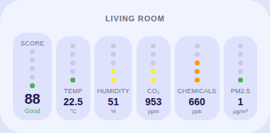 | 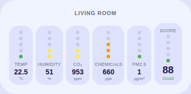 |

<br>

## Score position modes

| Value | Description |
|-------|-------------|
| `center` | Score ring centered above the sensor row (default) |
| `left` | Score ring on the left, sensors fill the remaining width |
| `right` | Score ring on the right, sensors fill the remaining width |
| `inline_left` | No ring — score as first column (left) with dot indicator |
| `inline_right` | No ring — score as last column (right) with dot indicator |

<br>

## Features

- Score ring or inline score column with color-coded severity label
- Up to 5 sensor columns with 5-dot bar indicators
- Dot color reflects severity: 🟢 → 🟡 → 🟠 → 🔴 → 🟣
- Three visual themes: `default`, `mushroom`, `bubble`
- Five score positions: `center`, `left`, `right`, `inline_left`, `inline_right`
- Full UI editor — configure everything without touching YAML
- Sensors can be added, removed, and reordered in the editor
- Awair thresholds pre-loaded as defaults
- Tap any sensor column to open the entity detail dialog (or configure a custom `tap_action`)
- Built on top of `LitElement` and `<ha-form>` for native Home Assistant look-and-feel
- Locale-aware value formatting (respects your HA profile's number format)
- `getGridOptions()` support for the Sections dashboard (HA 2024.10+)

<br>

## Requirements

- **Home Assistant 2026.5.0** or newer.
  Older HA cores must use Air Dots Card **0.8.8**.

<br>

## Installation

### Option A — HACS (recommended)

1. Open HACS in Home Assistant
2. Go to **Frontend** → click ⋮ → **Custom repositories**
3. Add `https://github.com/tioan/air-dots-card` with category **Lovelace**
4. Search for **Air Dots Card** and install it
5. Hard-reload the browser (`Ctrl+Shift+R`)

---

### Option B — Manual

**1 — Copy the file**

Copy `air-dots-card.js` into your Home Assistant `www` folder:

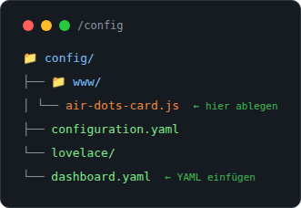

```
/config/www/air-dots-card.js
```

> If the `www` folder doesn't exist yet, create it inside `/config/`.

---

**2 — Register the resource**

Go to **Settings → Dashboards → ⋮ Menu → Resources** and add:

| Field | Value |
|-------|-------|
| URL | `/local/air-dots-card.js` |
| Resource type | `JavaScript Module` |

---

**3 — Add the card via UI**

Click **Add Card**, search for **Air Dots Card** and select it. The card opens in the visual editor.

<br>

## UI Editor

The editor is fully translated — it switches language automatically based on your browser locale, or you can set it explicitly via the language dropdown.

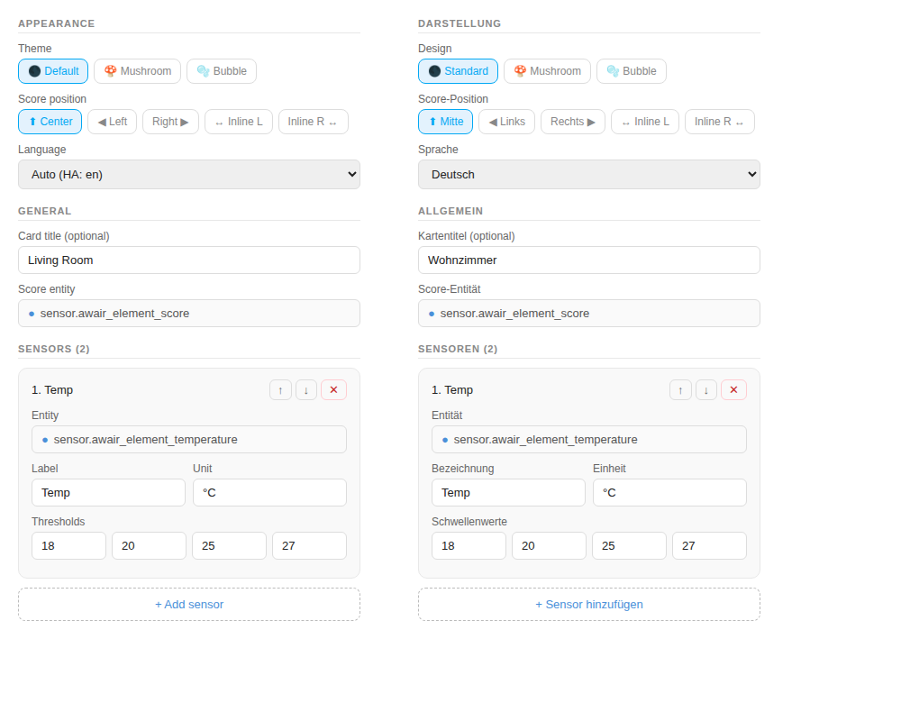

### What you can configure

| Setting | Description |
|---------|-------------|
| Theme | Visual style: Default, Mushroom or Bubble Card |
| Score position | `center` · `left` · `right` · `inline_left` · `inline_right` |
| Language | `Auto` (browser locale) · `English` · `Deutsch` |
| Card title | Optional label above the card |
| Score entity | HA sensor providing the score (0–100) |
| Sensor entity | Entity picker per sensor (auto-fills label/unit from entity attributes if blank) |
| Label / Unit | Display name and unit string — leave blank to inherit `friendly_name` / `unit_of_measurement` from the entity |
| Thresholds | 4 values defining the 5 severity levels |
| Symmetric scale | Toggle for sensors where the optimal range is in the middle (temp, humidity) |

Sensors can be **reordered** with ↑ / ↓ and **removed** with ✕. New sensors are added with **+ Add sensor** and come pre-filled with the next Awair default.

> **Tip:** Switch between visual editor and YAML at any time using the `< >` toggle in the card editor header.

<br>

## YAML configuration

```yaml
type: custom:air-dots-card
title: Living Room
theme: default                # default | mushroom | bubble
score_position: center        # center | left | right | inline_left | inline_right
language: auto                # auto | en | de

score_entity: sensor.awair_element_score

sensors:
  - entity: sensor.awair_element_temperature
    label: Temp
    unit: "°C"
    thresholds: [18, 20, 25, 27]
    symmetric: true

  - entity: sensor.awair_element_humidity
    label: Humidity
    unit: "%"
    thresholds: [30, 40, 60, 65]
    symmetric: true

  - entity: sensor.awair_element_co2
    label: "CO₂"
    unit: ppm
    thresholds: [600, 1000, 2000, 4500]

  - entity: sensor.awair_element_voc
    label: Chemicals
    unit: ppb
    thresholds: [300, 500, 3000, 25000]

  - entity: sensor.awair_element_pm25
    label: PM2.5
    unit: "µg/m³"
    thresholds: [12, 35, 55, 150]
```

### All options

| Option | Type | Default | Description |
|--------|------|---------|-------------|
| `theme` | string | `default` | `default` · `mushroom` · `bubble` |
| `score_position` | string | `center` | `center` · `left` · `right` · `inline_left` · `inline_right` |
| `language` | string | `auto` | `auto` (HA profile language) · `en` · `de` |
| `title` | string | — | Optional label above the card |
| `score_entity` | string | — | HA sensor providing score (0–100) |
| `sensors` | list | — | List of sensor definitions |
| `score_tap_action` | object | `more-info` | Tap action for the inline score column. See **Tap actions** below. |

#### Sensor options

| Option | Type | Required | Description |
|--------|------|----------|-------------|
| `entity` | string | ✅ | Entity ID |
| `label` | string | ✅ | Display name |
| `unit` | string | ✅ | Unit string |
| `thresholds` | list | ✅ | 4 boundary values (see below) |
| `symmetric` | bool | — | `true` for sensors where the optimal range is in the center (temp, humidity). Thresholds define `[low_bad, low_ok, high_ok, high_bad]`. Default: `false` (linear scale, higher = worse). |
| `tap_action` | object | `more-info` | Custom tap action for this sensor column. See **Tap actions** below. |

> **Note:** `label` and `unit` are now optional — if omitted, the card uses
> the entity's `friendly_name` and `unit_of_measurement` attributes.

> **Note:** `mushroom` and `bubble` themes inherit HA CSS variables automatically — no extra integration needed.

#### Tap actions

Each sensor and the inline score column support a HA-standard `tap_action`
object. Without configuration the card opens the entity's more-info dialog.

```yaml
sensors:
  - entity: sensor.awair_element_co2
    tap_action:
      action: navigate          # more-info | navigate | url | perform-action | none
      navigation_path: /lovelace/air-quality

score_tap_action:
  action: url
  url_path: https://www.getawair.com/
```

Supported actions: `more-info` (default), `navigate` (with `navigation_path`),
`url` (with `url_path`), `perform-action` / `call-service`
(with `perform_action` or `service`, optional `data` and `target`), `none`.

<br>

## Awair threshold reference

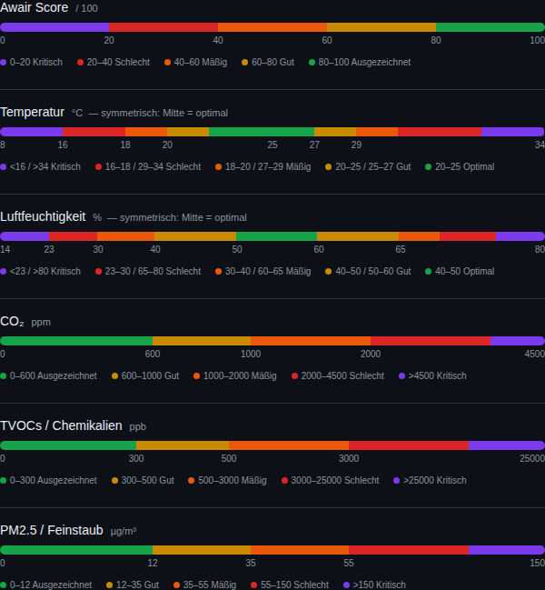

> Temperature and humidity use a **symmetric** scale (both extremes are bad, middle is optimal).  
> CO₂, TVOCs and PM2.5 are **linear** — higher is always worse.

### Official thresholds

| Sensor | Unit | L1 🟢 | L2 🟡 | L3 🟠 | L4 🔴 | L5 🟣 | `thresholds` |
|--------|------|--------|--------|--------|--------|--------|--------------|
| Score | /100 | 80–100 | 60–80 | 40–60 | 20–40 | 0–20 | *(inverted)* |
| Temperature | °C | 20–25 | 18–20 / 25–27 | 16–18 / 27–29 | <16 / 29–34 | <8 / >34 | `[18, 20, 25, 27]` |
| Humidity | % | 40–60 | 30–40 / 60–65 | 23–30 / 65–80 | <23 / >80 | <14 | `[30, 40, 60, 65]` |
| CO₂ | ppm | 0–600 | 600–1000 | 1000–2000 | 2000–4500 | >4500 | `[600, 1000, 2000, 4500]` |
| TVOCs | ppb | 0–300 | 300–500 | 500–3000 | 3000–25000 | >25000 | `[300, 500, 3000, 25000]` |
| PM2.5 | µg/m³ | 0–12 | 12–35 | 35–55 | 55–150 | >150 | `[12, 35, 55, 150]` |

<br>

## Compatible sensors

- **Awair Element / Omni / 2nd Edition** — via [Awair integration](https://www.home-assistant.io/integrations/awair/)
- **Sensirion SEN55 / SPS30** — via ESPHome
- **SCD40 / SCD41** — via ESPHome
- **BME680 / BME688** — via ESPHome (no PM2.5)
- **IKEA VINDSTYRKA** — via Zigbee2MQTT

<br>

## Troubleshooting

**Card not appearing** → Hard-reload (`Ctrl+Shift+R`) and clear cache.  
**"Custom element doesn't exist"** → Check resource URL is `/local/air-dots-card.js` and type is `JavaScript Module`. With HACS this is added automatically.  
**Score shows `--`** → Verify `score_entity` exists with a numeric state.  
**UI editor not showing** → Resource type must be `JavaScript Module`, not `JavaScript`.  
**Mushroom/Bubble looks wrong** → Check your HA theme is set under Profile → Theme.

<br>

## License

MIT — free to use, modify and share.

<br>

## Credits

This card was developed interactively with **[Claude Sonnet 4.6](https://claude.ai)** by Anthropic.  
The design is inspired by the [Awair Element](https://www.getawair.com/) air quality monitor UI.

Source code: [github.com/tioan/air-dots-card](https://github.com/tioan/air-dots-card)
